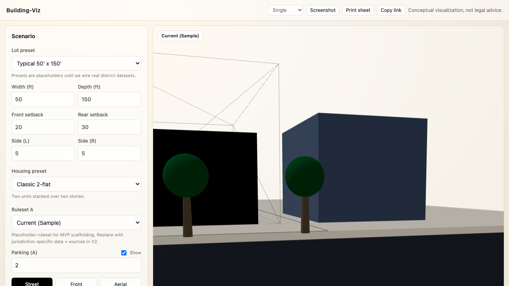
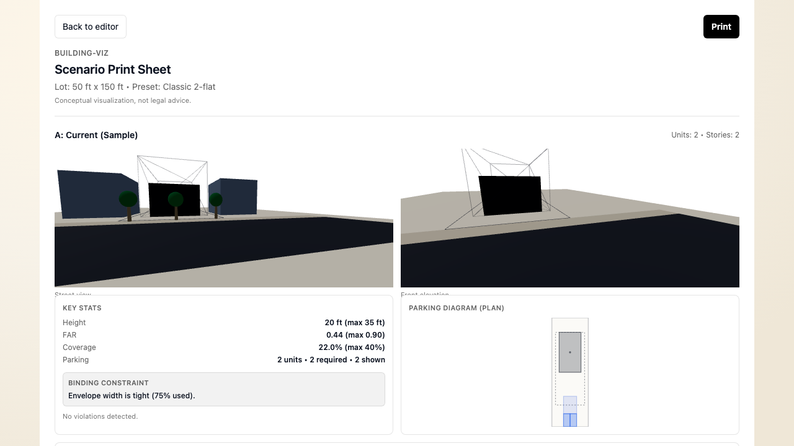

# Building-Viz

Browser-based 3D visualizer for showing what small multifamily housing can fit on a lot under zoning-like constraints, with context, comparison, and shareable exports.



## Spec
- Consolidated implementation spec: `SPEC.md`
- Source docs (original inputs): `docs/source/`

## Quick Start
Prereqs:
- Node.js 20+

Run:
```bash
npm install
npm run dev
```

Open:
- http://127.0.0.1:5173

## How To Use
- Pick a lot preset (or enter custom width/depth + setbacks)
- Pick a housing preset
- Toggle `Single` vs `Compare`
- Use `Copy link` to share a fully-encoded scenario URL
- Use `Screenshot` to download a PNG from the WebGL canvas
- Use `Print sheet` to open a print-friendly one-pager (then click `Print`)

Print sheet example:



## Scripts
```bash
npm run dev        # start Vite dev server
npm run build      # typecheck + production build
npm run preview    # preview production build locally
npm run lint       # eslint
npm run typecheck  # tsc
npm test           # vitest (CI mode)
npm run test:watch # vitest watch mode
```

## Project Layout
- `src/App.tsx`: main editor UI (controls, stats, share/export)
- `src/domain/`: core “zoning + evaluation” logic (pure, tested)
- `src/view/`: 3D rendering (React Three Fiber)
- `src/print/`: print-sheet route (driven by URL state)

## Disclaimer
This is a conceptual visualization tool. It is not legal advice and does not guarantee code compliance.

## Agent-Browser
With the dev server running:
```bash
agent-browser open http://127.0.0.1:5173
agent-browser snapshot -i
agent-browser screenshot /tmp/building-viz.png
```
